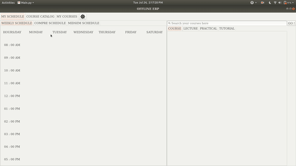

# OFFLINE ERP  
Tired of making your timetable on paper ? OFFLINE ERP is here to help you !!
This is a basic desktop application made using python which allows you to select courses (CDCs and Electives) for your timetable. 

> Tested for both Windows and Unix based systems. 
> Developed on Python version 3.7.4

**Please go through the Note Section at the end. It contains some common errors and tips which you should keep in mind while using it.**

## Features
It allows you to - 

  - Select your courses 
  - Save it in pdf format
  - Open your last saved/unsaved work

You can view your :
  - Weekly Schedule
  - Compre Schedule
  - Midsem Schedule
  - List of all the available courses 
  - Opted courses

This app will give you warnings/ dialog box :
  - When you change a section of a class
  - When there is time clash
  - When you choose a course which has same compre date and session
  - When you don't create a database or exit your work without saving it

## How to Use :
1. Double click on the row to select any course, lecture, practical or tutorial.
2. If there are no sections available for a particular course, the list will display NA. You can select NA to automatically move onto the next page or
  you can manually select the class type.
3. You need to remove all the section(s) associated with a particular course to delete it from exam timetable.
4. If you want to change a section of a course which you have already opted, search the course and directly select the section you want.
5. You can open your last saved/unsaved work using the settings button on the top.

## Installation
Please follow the steps according to your OS:
  1. [Windows](docs/windows.md)
  2. [Unix based](docs/unix-based.md)

If you face any problems, please read this [doc.]()

## Contributing
Contributions are always welcome! Please read the [contribution guidelines](docs/CONTRIBUTING.md) first.

## Author
-  [**Pranjal Gupta**](https://github.com/PranjalGupta2199/)

## TODOs
- > Extend for Windows Systems
- Add credits to your timetable
- Extend support for other campuses 

